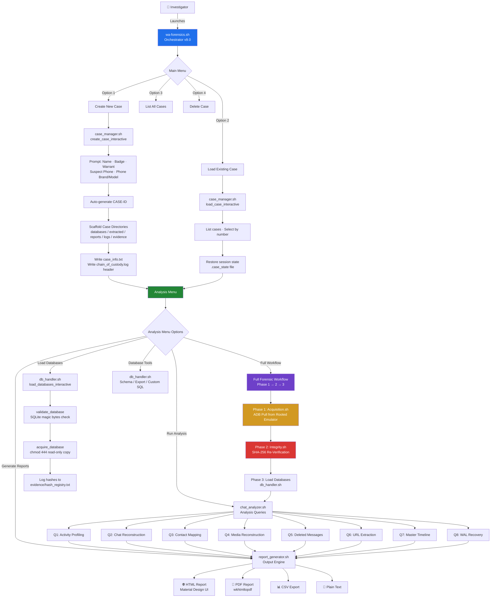
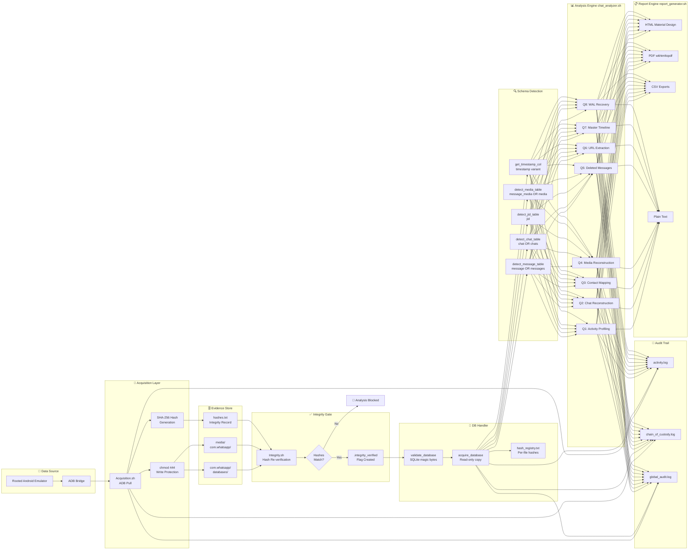
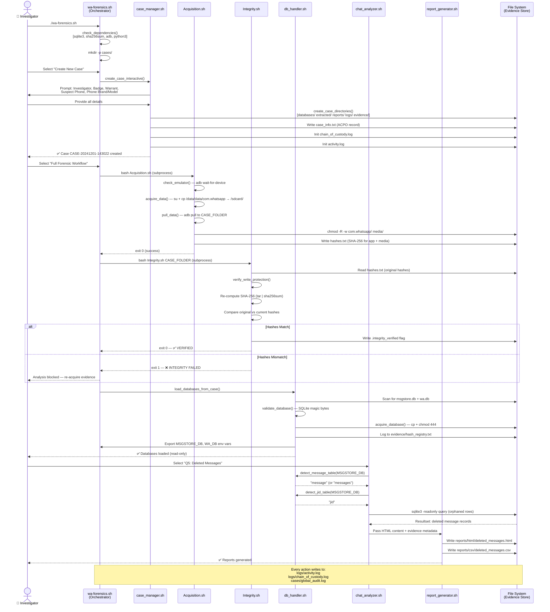
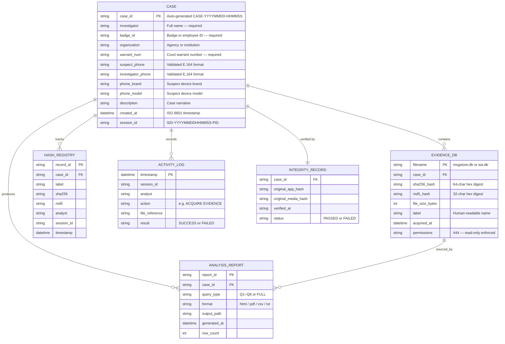
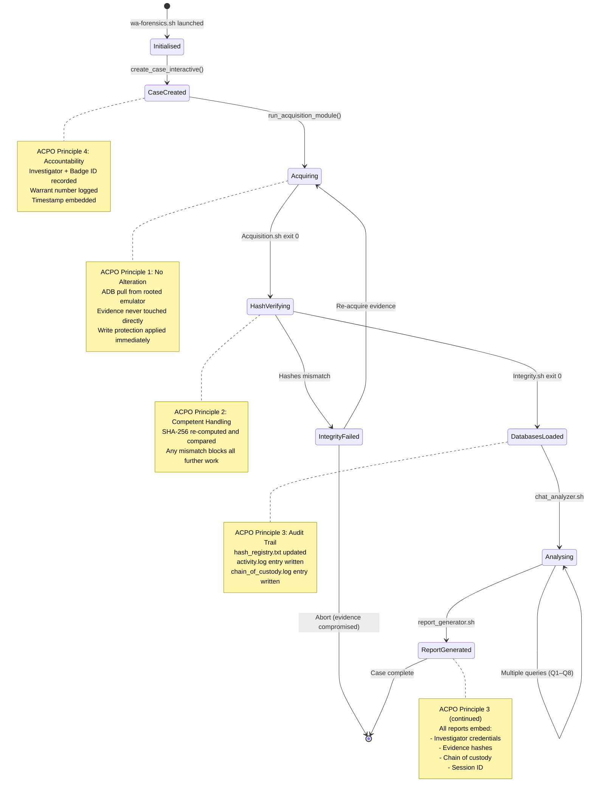

# WA-Forensics Toolkit

<div align="center">


### A Unified, ACPO-Compliant WhatsApp Digital Forensic Toolkit for Android

**Malawi University of Science and Technology (MUST)**  
Department of Computer Systems & Security · Group 9

---

[](https://github.com/moseschazama/wa-forensics)
[](LICENSE)
[](https://ubuntu.com)
[](https://www.gnu.org/software/bash/)
[](https://www.sqlite.org)
[](https://www.college.police.uk)
[](https://github.com/moseschazama/wa-forensics)

</div>

---

## Table of Contents

1. [Project Overview](#1-project-overview)
2. [Problem Statement](#2-problem-statement)
3. [Motivation & Objectives](#3-motivation--objectives)
4. [Solution Explanation](#4-solution-explanation)
5. [Alignment with Proposal](#5-alignment-with-proposal)
6. [System Architecture](#6-system-architecture)
7. [System Design & Workflow Diagrams](#7-system-design--workflow-diagrams)
8. [Code Structure](#8-code-structure)
9. [Module Deep-Dive](#9-module-deep-dive)
10. [Technologies Used](#10-technologies-used)
11. [Installation & Setup](#11-installation--setup)
12. [Usage Guide](#12-usage-guide)
13. [ACPO Compliance Framework](#13-acpo-compliance-framework)
14. [Testing & Validation](#14-testing--validation)
15. [Challenges & Solutions](#15-challenges--solutions)
16. [Future Improvements](#16-future-improvements)
17. [Conclusion](#17-conclusion)
18. [Team & Acknowledgements](#18-team--acknowledgements)
19. [License](#19-license)

---

## 1. Project Overview

**WA-Forensics** is a portable, open-source digital forensic toolkit purpose-built for acquiring, validating, parsing, analyzing, and reporting on WhatsApp evidence extracted from Android devices. It operates **entirely in read-only mode**, maintains a cryptographically verifiable **chain of custody**, and produces **court-admissible reports** in HTML, PDF, CSV, and plain-text formats — all from a single, unified Bash environment requiring no commercial software.

The toolkit covers the complete forensic investigation lifecycle end-to-end:

```
Evidence Acquisition  →  Integrity Hashing  →  Database Analysis  →  Report Generation  →  Chain of Custody
```

It was designed with investigators, lecturers, legal practitioners, and security researchers in mind, and is especially suited for resource-constrained environments where commercial tools such as **Cellebrite UFED** (costing upwards of **$10,000 per year**) are inaccessible.

### Core Capabilities at a Glance

| Capability | Detail |
|---|---|
| **Acquisition Method** | Rooted Android Emulator via ADB (bypasses encryption at the OS level) |
| **Evidence Integrity** | SHA-256 + MD5 hashing at acquisition; re-verified before analysis |
| **Database Access** | `sqlite3 -readonly` — evidence databases are never modified |
| **Forensic Analyses** | 8 schema-agnostic query modules covering the full communication lifecycle |
| **Report Formats** | HTML (Material Design UI), PDF (wkhtmltopdf), CSV, Plain Text |
| **Audit Logging** | Per-case `activity.log`, `chain_of_custody.log`, and global `audit.log` |
| **ACPO Compliance** | All four ACPO Good Practice Principles embedded by design |
| **Write Protection** | Evidence files `chmod 444` immediately after acquisition |

---

## 2. Problem Statement

Malawi has seen a sharp rise in WhatsApp-related cybercrimes — including **mobile money fraud, impersonation, sextortion, and cyberbullying** — yet law enforcement agencies remain critically under-equipped to investigate them. While Section 83 of the **Electronic Transactions and Cyber Security Act No. 33 of 2016** authorises the seizure and preservation of digital evidence, the operational capacity to act on this authority is severely limited.

Several interconnected problems underpin this gap:

### 2.1 Fragmented Tooling

Existing open-source tools such as WhatsApp Viewer, Whapa, and WhatsApp Key/Database Extractor perform isolated functions and cannot interoperate. Investigators must manually chain disjointed workflows — often resorting to error-prone workarounds such as APK downgrades — to complete a single analysis.

### 2.2 Dependence on Full-Device Imaging

Conventional forensic approaches rely on full-device imaging, which is wasteful and misaligned with modern investigative needs where relevant evidence resides entirely within a single application. This prolongs examinations and consumes disproportionate resources.

### 2.3 Admissibility Failures

The **NOCMA fuel procurement scandal** in Malawi exposed how WhatsApp evidence — when collected without proper forensic methods — can be successfully challenged in court and rendered inadmissible. Investigations relying on screenshots and manual phone inspection are inherently fragile.

### 2.4 Capacity Deficit

Malawi faces a shortage of specialists trained in mobile and messaging-app forensics, and most police stations lack access to secure servers or standardised verification frameworks.

---

## 3. Motivation & Objectives

### Primary Aim

To design, develop, and evaluate a **unified WhatsApp Forensic Toolkit for Android** that enhances and streamlines acquisition, analysis, and reporting of digital evidence for WhatsApp-related cybercrime investigations in Malawi, ensuring admissibility in legal proceedings under the Electronic Transactions and Cyber Security Act (2016).

### Objectives

| # | Objective | Status |
|---|---|---|
| 1 | Analyse existing open-source WhatsApp forensic tools for integration into a unified toolkit | ✅ Completed |
| 2 | Integrate tool modules into a single portable environment enabling sparse acquisition, triage, and reporting | ✅ Completed |
| 3 | Validate the toolkit using simulated cybercrime scenarios on a rooted Android emulator | ✅ Completed |
| 4 | Evaluate and compare performance against existing fragmented forensic tools | 🔄 In Progress |

### Research Questions Addressed

- Can a Bash-native toolkit achieve forensic-grade chain of custody without commercial software?
- Can WhatsApp databases extracted from a rooted Android emulator yield court-admissible evidence?
- Can schema-agnostic SQLite queries reliably recover deleted messages across multiple WhatsApp versions?

---

## 4. Solution Explanation

### 4.1 What the System Does

WA-Forensics provides a **single-command forensic investigation environment** that walks an investigator through every stage of a WhatsApp evidence examination:

1. **Case Management** — creates a structured, tamper-evident case workspace with auto-generated IDs, investigator credentials, warrant numbers, and full directory scaffolding.
2. **Evidence Acquisition** — uses ADB to extract WhatsApp SQLite databases (`msgstore.db`, `wa.db`) from a rooted Android emulator, copying them into a read-only evidence store and immediately computing and logging SHA-256 and MD5 hashes.
3. **Integrity Verification** — re-hashes acquired evidence at the start of every analysis session and compares against the acquisition-time hashes. Analysis is blocked if integrity fails.
4. **Forensic Analysis** — executes eight schema-agnostic forensic queries across the evidence databases.
5. **Report Generation** — produces Google Material Design HTML reports, CSV exports, plain-text transcripts, and PDF outputs — all embedding chain-of-custody metadata and investigator credentials.
6. **Audit Logging** — records every action across a per-case activity log, a chain-of-custody log, and a global cross-case audit log with session tracking.

### 4.2 How It Solves the Problem

The toolkit consolidates what previously required **four or more separate tools** into a single interactive shell application. It enforces forensic best practices by design — the analyst cannot modify evidence files, every operation is timestamped and attributed, and reports include cryptographic integrity records that satisfy **ACPO Principle 3** (audit trail) and **Section 16** of Malawi's Electronic Transactions and Cyber Security Act.

### 4.3 The Eight Forensic Analysis Modules

| # | Module | Purpose | Key Insight |
|---|---|---|---|
| Q1 | **Activity Profiling** | Maps communication frequency by hour, day, contact | Identifies peak activity windows and communication networks |
| Q2 | **Chat Reconstruction** | Rebuilds full conversation threads with timestamps | Provides readable, courtroom-ready conversation records |
| Q3 | **Contact Mapping** | Links JIDs to display names and phone numbers | Resolves anonymised identifiers to real-world identities |
| Q4 | **Media Reconstruction** | Catalogues all shared files: images, video, audio, documents | Establishes what digital assets were transmitted |
| Q5 | **Deleted Message Detection** | Recovers soft-deleted messages from orphaned database rows | Recovers evidence that suspects attempted to conceal |
| Q6 | **URL Extraction** | Extracts all links shared in conversations | Identifies external platforms, fraud sites, or coordination channels |
| Q7 | **Master Timeline** | Chronologically orders all events across all chats | Provides a single narrative of digital activity |
| Q8 | **WAL Journal Recovery** | Parses SQLite Write-Ahead Log for uncommitted transactions | Recovers messages deleted before WAL checkpoint |

### 4.4 Key Technical Features

- **Schema-agnostic queries** — automatically detects whether the database uses `message`/`messages`, `chat`/`chats`, and other schema variants across WhatsApp versions via runtime introspection (`detect_message_table()`, `detect_chat_table()`, `detect_jid_table()`)
- **Read-only SQLite mode** — all database access uses `sqlite3 -readonly`, preventing accidental modification of evidence
- **ACPO compliance** — case records embed the four ACPO Good Practice Principles at creation time
- **WAL recovery** — attempts to recover deleted or uncommitted messages from SQLite Write-Ahead Log files
- **Interactive deep-dive** — per-chat HTML transcripts with tabbed views: messages, media, URLs, metadata, and chain of custody
- **Global audit log** — cross-case statistics and searchable audit trail with colour-coded result statuses
- **Quick Start mode** — single-command pipeline that creates a case, loads databases, runs all eight analyses, and generates all report formats
- **Portable design** — runs on any Ubuntu/Debian Linux system; deployable on a CAINE OS USB drive

---

## 5. Alignment with Proposal

The implementation directly realises each architectural decision made in the research proposal:

| Proposal Decision | Implementation |
|---|---|
| Unified, automated framework replacing fragmented tools | Single `wa-forensics.sh` entry point sourcing four modular libraries |
| Sparse/targeted acquisition over full-device imaging | `acquire_database()` copies only `msgstore.db` and `wa.db`; WAL/SHM files included |
| Emulator-based acquisition to bypass WhatsApp encryption | `Acquisition.sh` uses ADB on a rooted emulator — no key files required |
| Integrity verification via `sha256sum` | `validate_database()` computes and logs SHA-256 + MD5 hashes into `hash_registry.txt` |
| Chain-of-custody logging | `log_action()` writes to per-case `activity.log`, `chain_of_custody.log`, and global `audit.log` |
| Schema-agnostic parsing | `detect_message_table()`, `detect_chat_table()`, `detect_jid_table()` runtime introspection |
| Court-ready HTML/PDF reports | Google Material Design HTML with embedded chain-of-custody metadata; `wkhtmltopdf` PDF export |
| ACPO compliance framework | Case records embed all four ACPO Principles at creation time |
| Role-based case management | Investigator name, badge ID, organisation, and warrant number required before any analysis |
| Write protection enforcement | `chmod 444` applied to all evidence files immediately after acquisition |

---

## 6. System Architecture

### 6.1 Architectural Overview

The toolkit follows a **modular shell library architecture** with a single entry-point orchestrator (`wa-forensics.sh`) that sources four specialised library modules. Two standalone modules (`Acquisition.sh`, `Integrity.sh`) handle the pre-analysis phases and are invoked as subprocesses. This mirrors an **MVC-style separation of concerns** within the constraints of a Bash environment.

```
┌──────────────────────────────────────────────────────────────────────────────┐
│                             wa-forensics.sh                                  │
│                        (Entry Point / Orchestrator)                          │
│                                                                              │
│  • Global state initialisation (SESSION_ID, colours, case variables)        │
│  • Dependency checks (sqlite3, sha256sum, md5sum, adb, python3)             │
│  • Main Menu / Analysis Menu / Quick Start pipeline                         │
│  • log_action() — universal audit writer                                    │
│  • confirm() / pause() / print_* — unified UI utilities                     │
└───────────────────────────┬──────────────────────────────────────────────────┘
                            │ bash source (shared process environment)
           ┌────────────────┼────────────────┬────────────────────────┐
           ▼                ▼                ▼                        ▼
┌────────────────┐ ┌──────────────┐ ┌─────────────────┐ ┌───────────────────┐
│ case_manager   │ │ db_handler   │ │ chat_analyzer   │ │ report_generator  │
│     .sh        │ │    .sh       │ │     .sh         │ │      .sh          │
│                │ │              │ │                 │ │                   │
│ create_case_   │ │ validate_    │ │ detect_message_ │ │ generate_html_    │
│ interactive()  │ │ database()   │ │ table()         │ │ report()          │
│                │ │              │ │                 │ │                   │
│ load_case_     │ │ acquire_     │ │ detect_chat_    │ │ generate_pdf_     │
│ interactive()  │ │ database()   │ │ table()         │ │ report()          │
│                │ │              │ │                 │ │                   │
│ list_all_      │ │ auto_        │ │ detect_jid_     │ │ export_csv_       │
│ cases()        │ │ discover_    │ │ table()         │ │ report()          │
│                │ │ databases()  │ │                 │ │                   │
│ save_case_     │ │ run_query()  │ │ Q1–Q8 forensic  │ │ generate_text_    │
│ state()        │ │              │ │ analysis funcs  │ │ report()          │
│                │ │ export_raw_  │ │                 │ │                   │
│ delete_case_   │ │ tables()     │ │ get_dashboard_  │ │ generate_all_     │
│ menu()         │ │              │ │ stats()         │ │ reports()         │
│                │ │ custom_sql_  │ │                 │ │                   │
│ view_case_     │ │ query()      │ │ Per-chat HTML   │ │ wkhtmltopdf       │
│ info()         │ │              │ │ deep-dive       │ │ PDF export        │
└────────────────┘ └──────────────┘ └─────────────────┘ └───────────────────┘
           │                │                │                        │
           └────────────────┴────────────────┴────────────────────────┘
                                      │
                  ┌───────────────────▼────────────────────┐
                  │             cases/ (File Store)         │
                  │                                         │
                  │  CASE-YYYYMMDD-HHMMSS/                  │
                  │  ├── case_info.txt                       │
                  │  ├── .case_state                         │
                  │  ├── .integrity_verified                 │
                  │  ├── databases/    (chmod 444)           │
                  │  │   ├── msgstore.db                     │
                  │  │   ├── wa.db                           │
                  │  │   └── msgstore.db-wal                 │
                  │  ├── extracted/                          │
                  │  │   ├── chats/                          │
                  │  │   ├── contacts/                       │
                  │  │   ├── media/                          │
                  │  │   └── urls/                           │
                  │  ├── reports/ (html / pdf / csv / text)  │
                  │  ├── evidence/                           │
                  │  │   └── hash_registry.txt               │
                  │  └── logs/                               │
                  │      ├── activity.log                    │
                  │      └── chain_of_custody.log            │
                  └─────────────────────────────────────────┘

                  cases/global_audit.log  (cross-case)
```

### 6.2 Standalone Module Integration

Two modules execute as subprocesses and integrate with the main toolkit via exported environment variables:

```
┌─────────────────────────────────────────────────────────────────┐
│                        wa-forensics.sh                          │
│                                                                 │
│  run_acquisition_module()  ──bash──►  Acquisition.sh           │
│       │                                    │                   │
│       │  exports: CASE_DIR, CASES_ROOT     │                   │
│       │  receives: CASE_FOLDER             │                   │
│       │                                    │                   │
│       │  ADB → emulator → pull data        │                   │
│       │  chmod -R -w (write-protect)       │                   │
│       │  SHA-256 hash generation           │                   │
│       └────────────────────────────────────┘                   │
│                                                                 │
│  run_integrity_module()    ──bash──►  Integrity.sh             │
│       │                                    │                   │
│       │  receives: CASE_FOLDER as arg      │                   │
│       │                                    │                   │
│       │  verify_write_protection()         │                   │
│       │  verify_app_data() — re-hash       │                   │
│       │  verify_media() — re-hash          │                   │
│       │  handle_failure() — blocks         │                   │
│       │  analysis if hashes mismatch       │                   │
│       └────────────────────────────────────┘                   │
│                                                                 │
│  → If both pass: write .integrity_verified flag                 │
│  → Load databases: load_databases_from_case()                  │
│  → Proceed to Analysis Menu                                     │
└─────────────────────────────────────────────────────────────────┘
```

---

## 7. System Design & Workflow Diagrams

### 7.1 High-Level System Architecture



---

### 7.2 Evidence Acquisition & Integrity Workflow

```mermaid
flowchart TD
    START([🚀 Investigator Launches<br/>Full Forensic Workflow]) --> P1

    subgraph P1["📥 PHASE 1 — Evidence Acquisition  Acquisition.sh"]
        A1[Check ADB Connection<br/>adb wait-for-device] --> A2{Emulator<br/>Connected?}
        A2 -->|No| A3[Display Instructions<br/>Wait for Emulator] --> A2
        A2 -->|Yes| A4[Wait for Full Boot<br/>sys.boot_completed = 1]
        A4 --> A5[Root Shell: su<br/>Copy /data/data/com.whatsapp → /sdcard/]
        A5 --> A6{Copy<br/>Succeeded?}
        A6 -->|No| A7[Retry or Abort] --> A5
        A6 -->|Yes| A8[ADB Pull to CASE_FOLDER<br/>com.whatsapp/ and media/]
        A8 --> A9[Apply Write Protection<br/>chmod -R -w on evidence folders]
        A9 --> A10[Generate SHA-256 Hashes<br/>tar | sha256sum for app data + media]
        A10 --> A11[Write hashes.txt<br/>Signed with timestamp]
    end

    A11 --> P2

    subgraph P2["🔒 PHASE 2 — Integrity Verification  Integrity.sh"]
        B1[Load CASE_FOLDER] --> B2[Verify Write Protection<br/>Check -w flag on evidence dirs]
        B2 --> B3[Extract Original Hashes<br/>from hashes.txt]
        B3 --> B4[Re-compute App Data Hash<br/>tar | sha256sum]
        B4 --> B5{App Hash<br/>Match?}
        B5 -->|No| FAIL[❌ INTEGRITY FAILED<br/>Analysis Blocked<br/>Re-acquire evidence]
        B5 -->|Yes| B6[Re-compute Media Hash<br/>tar | sha256sum]
        B6 --> B7{Media Hash<br/>Match?}
        B7 -->|No| FAIL
        B7 -->|Yes| B8[✅ ALL INTEGRITY CHECKS PASSED<br/>Write .integrity_verified flag]
    end

    B8 --> P3

    subgraph P3["💾 PHASE 3 — Database Loading  db_handler.sh"]
        C1[Scan case folder for<br/>msgstore.db and wa.db] --> C2[validate_database<br/>Check SQLite magic bytes]
        C2 --> C3[acquire_database<br/>Copy to databases/ chmod 444]
        C3 --> C4[Compute SHA-256 + MD5<br/>Write to hash_registry.txt]
        C4 --> C5[Export MSGSTORE_DB<br/>WA_DB env variables]
        C5 --> C6[save_case_state<br/>Persist to .case_state]
    end

    C6 --> READY([✅ Evidence Ready<br/>Proceed to Analysis Menu])
    FAIL --> RESTART([♻️ Re-acquire Fresh Evidence])

    style P1 fill:#d29922,color:#000
    style P2 fill:#da3633,color:#fff
    style P3 fill:#238636,color:#fff
    style FAIL fill:#da3633,color:#fff,stroke:#ff0000
    style READY fill:#238636,color:#fff
```

---

### 7.3 Forensic Analysis Data Flow (DFD)



---

### 7.4 Complete Investigation Sequence Diagram



---

### 7.5 Case Directory Entity Relationship Diagram



---

### 7.6 ACPO Compliance State Machine



---

## 8. Code Structure

```
wa-forensics/
│
├── wa-forensics.sh                 # Main entry point & orchestrator
│   └── Functions: banner(), main_menu(), analysis_menu(), quick_start(),
│                  check_dependencies(), log_action(), confirm(), pause(),
│                  full_forensic_workflow(), run_acquisition_module(),
│                  run_integrity_module(), load_databases_from_case(),
│                  validate_menu_input()
│
├── Acquisition.sh                  # Standalone: ADB evidence acquisition
│   └── Functions: check_emulator(), acquire_data(), pull_data()
│
├── Integrity.sh                    # Standalone: Evidence integrity verification
│   └── Functions: show_banner(), check_case_folder(), verify_write_protection(),
│                  verify_app_data(), verify_media(), load_databases(),
│                  handle_failure()
│
├── install.sh                      # Dependency installation script
│
├── lib/                            # Modular library components (sourced by orchestrator)
│   ├── case_manager.sh             # Case lifecycle management
│   │   └── Functions: create_case_interactive(), create_case_directories(),
│   │                  load_case_interactive(), load_case_by_id(),
│   │                  list_all_cases(), delete_case_menu(),
│   │                  save_case_state(), view_case_info(),
│   │                  validate_menu_input()
│   │
│   ├── db_handler.sh               # Database acquisition & validation
│   │   └── Functions: validate_database(), acquire_database(),
│   │                  auto_discover_databases(), prompt_database(),
│   │                  load_databases_interactive(), run_query(),
│   │                  extract_schema(), view_schema(),
│   │                  export_raw_tables(), database_integrity_check(),
│   │                  custom_sql_query()
│   │
│   ├── chat_analyzer.sh            # Forensic analysis engine — 8 queries
│   │   └── Functions: detect_message_table(), detect_chat_table(),
│   │                  detect_jid_table(), detect_media_table(),
│   │                  detect_link_table(), column_exists(),
│   │                  get_timestamp_col(), get_dashboard_stats(),
│   │                  analyze_activity_profile() [Q1],
│   │                  analyze_chat_reconstruction() [Q2],
│   │                  analyze_contact_mapping() [Q3],
│   │                  analyze_media_reconstruction() [Q4],
│   │                  analyze_deleted_messages() [Q5],
│   │                  analyze_url_extraction() [Q6],
│   │                  analyze_master_timeline() [Q7],
│   │                  analyze_wal_recovery() [Q8],
│   │                  run_all_analyses()
│   │
│   └── report_generator.sh         # HTML/PDF/CSV report builders
│       └── Functions: generate_html_report(), generate_pdf_report(),
│                      export_csv_report(), generate_text_report(),
│                      generate_all_reports()
│
├── cases/                          # Auto-generated at runtime (git-ignored)
│   └── CASE-YYYYMMDD-HHMMSS/
│       ├── case_info.txt           # Case metadata & ACPO compliance record
│       ├── .case_state             # Persistent session state (sourced on reload)
│       ├── .integrity_verified     # Written after successful Integrity.sh run
│       ├── hashes.txt              # Acquisition-time SHA-256 hashes
│       ├── databases/              # Read-only evidence copies (chmod 444)
│       │   ├── msgstore.db         # WhatsApp chat database
│       │   ├── wa.db               # WhatsApp contacts database
│       │   ├── msgstore.db-wal     # Write-Ahead Log (if present)
│       │   └── msgstore.db-shm     # Shared memory file (if present)
│       ├── extracted/
│       │   ├── chats/              # Per-chat CSV/HTML transcripts
│       │   ├── contacts/           # Contact mapping outputs
│       │   ├── media/              # Media catalogue exports
│       │   └── urls/               # URL extraction outputs
│       ├── reports/
│       │   ├── html/               # Material Design HTML reports
│       │   ├── pdf/                # PDF exports
│       │   ├── csv/                # CSV exports
│       │   └── text/               # Plain text reports
│       ├── evidence/
│       │   └── hash_registry.txt   # Per-file SHA-256 + MD5 records
│       ├── logs/
│       │   ├── activity.log        # Timestamped action log
│       │   └── chain_of_custody.log # CoC compliance record
│       └── temp/                   # Temporary working files
│
├── docs/
│   └── screenshots/
│       ├── banner.png
│       ├── main_menu.png
│       ├── case_creation.png
│       ├── acquisition.png
│       ├── integrity_pass.png
│       ├── analysis_menu.png
│       ├── html_report.png
│       └── chain_of_custody.png
│
├── .github/
│   └── workflows/
│       └── ci.yml                  # GitHub Actions CI pipeline
│
├── .gitignore
├── LICENSE                         # MIT License
└── README.md                       # This file
```

---

## 9. Module Deep-Dive

### 9.1 `wa-forensics.sh` — Orchestrator

The entry point initialises all global state and provides the shell framework that every other module operates within.

**Key responsibilities:**

- Exports `SESSION_ID`, `CASE_DIR`, `MSGSTORE_DB`, `WA_DB`, and all colour codes so child modules share the same environment
- Calls `check_dependencies()` to verify `sqlite3`, `sha256sum`, `md5sum`, `adb`, and `python3` before presenting any menu
- Provides `log_action()` — the universal audit writer that appends to both the per-case log and the global audit log simultaneously
- Implements `full_forensic_workflow()` which chains acquisition → integrity → database loading in strict order
- Manages the interactive menu loop with `validate_menu_input()` to prevent injection via non-integer choices

**Startup sequence:**
```
1. Set SCRIPT_DIR, LIB_DIR, CASES_ROOT, TEMPLATES_DIR
2. Generate SESSION_ID = SID-YYYYMMDDHHMMSS-$$
3. Create TEMP_DIR and register EXIT trap (cleanup)
4. Source lib/case_manager.sh, lib/db_handler.sh,
          lib/chat_analyzer.sh, lib/report_generator.sh
5. check_dependencies()
6. main_menu()
```

---

### 9.2 `Acquisition.sh` — Evidence Acquisition

Handles the physical extraction of WhatsApp data from a rooted Android emulator via ADB.

**Key design decisions:**

- **Emulator-based approach**: By targeting a rooted Android emulator (AVD), the toolkit bypasses WhatsApp's at-rest database encryption entirely. The WhatsApp process on a rooted emulator stores decrypted SQLite databases in `/data/data/com.whatsapp/databases/`, which ADB can access with root privileges.
- **Retry loop**: Both `acquire_data()` and `pull_data()` implement interactive retry loops. A single failure does not abort the session — the investigator can diagnose and retry without losing the case workspace.
- **Write protection**: Immediately after pulling, `chmod -R -w` is applied to all evidence folders. The case root itself is intentionally left writable so `wa-forensics.sh` can write integrity flag files after this script exits.
- **Hash file format**: The `hashes.txt` file uses a precisely defined format (`Hash value for com.whatsapp (WhatsApp app data): <hash>`) that `Integrity.sh` parses with `grep | cut -d':' -f2 | xargs`.

**ADB acquisition flow:**
```bash
adb wait-for-device                          # Block until emulator responds
adb shell getprop sys.boot_completed         # Wait for full OS boot
adb shell "su -c 'cp -r /data/data/com.whatsapp /sdcard/'"  # Root copy
adb pull /sdcard/com.whatsapp CASE_FOLDER/  # Pull to analyst machine
adb pull /sdcard/Android/media/com.whatsapp CASE_FOLDER/media/
```

---

### 9.3 `Integrity.sh` — Evidence Verification

Provides cryptographic proof that acquired evidence has not been modified between acquisition and analysis.

**Verification algorithm:**
```
Original hash (from hashes.txt) = SHA-256(tar archive at acquisition time)
Current hash                    = SHA-256(tar archive at verification time)
Match required for analysis to proceed
```

**Why `tar | sha256sum`?** Hashing a directory (not a single file) requires creating a reproducible byte stream. `tar -c DIR | sha256sum` produces a deterministic hash of the entire directory tree including file metadata. This is the same approach used by professional forensic tools for folder-level integrity.

**Failure behaviour:**
- `handle_failure()` prints a detailed forensic summary specifying which check failed
- `exit 1` is returned to `wa-forensics.sh`, which blocks all analysis menu options
- The investigator is given the option to re-acquire fresh evidence or abort

---

### 9.4 `lib/case_manager.sh` — Case Lifecycle Management

Manages the full lifecycle of forensic cases from creation through to deletion.

**Case directory scaffold** (created by `create_case_directories()`):

```
databases/          — Evidence database copies (chmod 444)
extracted/chats/    — Per-chat conversation transcripts
extracted/contacts/ — Contact resolution outputs
extracted/media/    — Media catalogue files
extracted/urls/     — Extracted hyperlinks
reports/html/       — Material Design HTML reports
reports/pdf/        — PDF exports
reports/csv/        — CSV data exports
reports/text/       — Plain text reports
evidence/           — hash_registry.txt (integrity records)
logs/               — activity.log, chain_of_custody.log
temp/               — Temporary working files
```

**Input validation highlights:**
- Case IDs are restricted to `[a-zA-Z0-9_-]` — no path traversal possible
- Phone numbers validated against `^[+]?[0-9]{7,15}$`
- All required fields enforced with loop-until-valid prompts

**Persistent state** (`save_case_state()`): Case variables are written to `.case_state` as `export VAR=value` lines. When a case is reloaded, this file is sourced to restore the full session context, allowing investigators to close and resume cases without data loss.

---

### 9.5 `lib/db_handler.sh` — Database Handler

Manages all interactions with WhatsApp SQLite databases in a forensically sound manner.

**`validate_database()`** performs:
1. File existence and non-zero size check
2. SQLite magic bytes verification: `head -c 15 | grep "SQLite format 3"`
3. Extension check for `.crypt*` files (encrypted databases)
4. SHA-256 and MD5 hash computation
5. Appends a signed integrity record to `evidence/hash_registry.txt`

**`run_query()`** is the universal query executor:
- Supports output formats: `csv`, `json`, `list`, `column`
- Always uses `sqlite3 -readonly` to prevent any writes
- Returns row count for audit logging
- Output is always written to a named file — never to stdout-only

**`custom_sql_query()`** security:
- Only `SELECT` statements are accepted (case-insensitive `toupper` check)
- The first keyword is extracted and compared — no multi-statement injection possible
- Read-only SQLite mode enforced at the driver level regardless

---

### 9.6 `lib/chat_analyzer.sh` — Forensic Analysis Engine

The largest and most technically complex module. Contains the schema detection subsystem and all eight forensic analysis functions.

**Schema detection subsystem:**

WhatsApp has changed its database schema multiple times across versions. The detection functions handle this gracefully:

| Function | Detects |
|---|---|
| `detect_message_table()` | `message` (newer) vs `messages` (legacy) |
| `detect_chat_table()` | `chat` vs `chats` |
| `detect_jid_table()` | `jid` (present in newer versions) |
| `detect_media_table()` | `message_media` vs `media` |
| `detect_link_table()` | `message_link` |
| `get_timestamp_col()` | `timestamp` vs `message_timestamp` vs `received_timestamp` |
| `column_exists()` | Generic column presence check via `PRAGMA table_info` |

**Analysis module technical details:**

**Q1 — Activity Profiling**: Groups messages by hour-of-day and day-of-week using `strftime()` on Unix epoch timestamps. Produces a heatmap of communication frequency that can establish an alibi or contradict one.

**Q2 — Chat Reconstruction**: Joins the message table with the JID table to resolve anonymised identifiers (`jid`) to human-readable phone numbers and display names. Orders by timestamp to produce a readable conversation thread.

**Q3 — Contact Mapping**: Cross-references `wa.db` with `msgstore.db` to map all JIDs encountered in messages to their display names and stored contact names in the suspect's contacts database.

**Q4 — Media Reconstruction**: Queries `message_media` or `media` tables to catalogue all files transmitted: type (image/video/audio/document), filename, size, MIME type, and associated message timestamp.

**Q5 — Deleted Message Detection**: Searches for messages with `status = -1` or `deleted = 1` flags, or orphaned rows where the parent chat no longer exists. These are soft-deleted records that WhatsApp marks but does not immediately zero out.

**Q6 — URL Extraction**: Queries the `message_link` table (where available) or applies a regex pattern (`http[s]?://[^\s]+`) against message text fields to extract all hyperlinks shared in conversations.

**Q7 — Master Timeline**: Performs a `UNION ALL` across the message table, media events, and link events, ordering by timestamp to produce a single chronological narrative of all digital activity in the evidence.

**Q8 — WAL Recovery**: Reads the `msgstore.db-wal` file if present and attempts to extract structured records from uncommitted WAL frames. This can recover messages that were deleted and checkpointed before the database was acquired.

---

### 9.7 `lib/report_generator.sh` — Report Engine

Produces court-admissible outputs embedding all required forensic metadata.

**Every report includes:**
- Case ID, investigator name, badge ID, organisation, warrant number
- Suspect phone number and device details
- Session ID and report generation timestamp
- Evidence file hashes (SHA-256 + MD5) from `hash_registry.txt`
- ACPO compliance statement
- Chain-of-custody log excerpt

**HTML reports** use Google Material Design aesthetics: dark-theme dashboard with stat cards, tabbed navigation, sortable tables, and a forensic metadata header. No external CDN dependencies — all styles are inlined.

**PDF export** uses `wkhtmltopdf` to convert the HTML report to a print-ready PDF suitable for court filing.

**CSV exports** are raw query outputs suitable for import into spreadsheet tools or statistical software.

---

## 10. Technologies Used

| Technology | Version | Role |
|---|---|---|
| **Bash** | 5.x | Entire toolkit runtime and scripting language |
| **SQLite3** | 3.x | Read-only forensic queries against WhatsApp databases |
| **ADB** (Android Debug Bridge) | Platform Tools | Evidence acquisition from rooted Android emulator |
| **Android Emulator** (AVD) | API 28–33 | Rooted virtual device for WhatsApp data extraction |
| **sha256sum / md5sum** | GNU coreutils | Evidence integrity hashing |
| **tar** | GNU tar | Directory-level hash computation for integrity verification |
| **wkhtmltopdf** | 0.12.x | HTML-to-PDF conversion for court-ready reports |
| **Python 3** | 3.8+ | Dependency check; available for future analysis helpers |
| **chmod / stat** | POSIX | Write protection enforcement and file metadata |
| **GitHub Actions** | — | CI/CD pipeline for automated testing |

### Why Bash?

Bash was chosen deliberately over Python or Ruby for three reasons:

1. **Zero installation footprint** — Bash is present on every Linux and CAINE OS distribution without any package installation.
2. **Forensic environment compatibility** — CAINE OS, the standard forensic live distribution, ships with Bash 5.x and SQLite3 by default.
3. **Direct system integration** — ADB calls, `chmod`, `sha256sum`, and file operations are native shell operations with no abstraction overhead that could introduce evidence-handling bugs.

---

## 11. Installation & Setup

### Prerequisites

- **Operating System**: Ubuntu 22.04+ / Debian 11+ / CAINE OS 13+
- **Android SDK Platform Tools**: For ADB (`adb` command)
- **Android Emulator**: AVD with API 28–33, rooted (Google APIs image)
- **WhatsApp**: Installed on the emulator and having generated chat data

### Step 1 — Clone the Repository

```bash
git clone https://github.com/MUST-CS-Group9/wa-forensics.git
cd wa-forensics
```

### Step 2 — Install System Dependencies

```bash
chmod +x install.sh
sudo ./install.sh
```

The install script installs:
- `sqlite3` — database engine
- `adb` (android-tools-adb) — device communication
- `wkhtmltopdf` — PDF generation
- `python3` — available for analysis helpers
- `coreutils` — sha256sum, md5sum, stat

**Manual installation** (if preferred):

```bash
sudo apt-get update
sudo apt-get install -y sqlite3 android-tools-adb wkhtmltopdf python3 coreutils
```

### Step 3 — Set Script Permissions

```bash
chmod +x wa-forensics.sh Acquisition.sh Integrity.sh
chmod +x lib/case_manager.sh lib/db_handler.sh lib/chat_analyzer.sh lib/report_generator.sh
```

### Step 4 — Prepare the Android Emulator

1. Install Android Studio and create an AVD:
   - API Level: 28–33
   - Image: **Google APIs** (required for root access)
   - ABI: x86_64
2. Start the emulator and install WhatsApp APK
3. Populate with test chat data (send/receive messages, share media, share URLs)
4. Verify ADB root access:

```bash
adb devices          # Should show: emulator-XXXX  device
adb shell "su -c id" # Should show: uid=0(root)
```

### Step 5 — Verify Installation

```bash
./wa-forensics.sh
```

The toolkit will run `check_dependencies()` and display a green ✔ for each satisfied dependency before showing the main menu.

---

## 12. Usage Guide

### Launching the Toolkit

```bash
cd wa-forensics
./wa-forensics.sh
```

You will see the ASCII banner followed by the main menu.

### Workflow Option A — Full Automated Pipeline (Recommended)

This option chains all three phases automatically:

```
Main Menu → [1] Create New Case → Enter case details
Analysis Menu → [Full Forensic Workflow]
  → Phase 1: Acquisition (ADB pull from emulator)
  → Phase 2: Integrity verification (SHA-256 comparison)
  → Phase 3: Database loading (read-only)
Analysis Menu → [Run All Analyses]
Analysis Menu → [Generate All Reports]
```

### Workflow Option B — Manual Step-by-Step

For experienced investigators who want full control:

```
1. Main Menu → [1] Create New Case
2. Analysis Menu → [Load Databases] → [Auto-discover]
3. Analysis Menu → [Q1 Activity Profiling]
4. Analysis Menu → [Q2 Chat Reconstruction] → Select contact
5. Analysis Menu → [Q5 Deleted Messages]
6. Analysis Menu → [Generate HTML Report]
```

### Example: Creating a Case

```
  Auto-generated Case ID: CASE-20241201-143022
  Use this ID? [Y/n/b]: Y

  Investigator Name        : Inspector Mwale
  Badge / Employee ID      : MWP-4521
  Investigator Phone No.   : +265888100200
  Organization             : Malawi Police Service
  Warrant / Case Number    : MW/CY/2024/0042
  Suspect Phone Number     : +265999456789
  Phone Brand              : Samsung
  Phone Model              : Galaxy A53
  Case Description         : Mobile money fraud via WhatsApp impersonation
```

### Example: Running Deleted Message Analysis

```
Analysis Menu → [5] Deleted Messages / Soft-Deleted Records

  [ℹ] Detecting database schema...
  [✔] Message table: message
  [✔] JID table: jid
  [ℹ] Querying for soft-deleted records...
  [✔] 14 deleted messages recovered
  [✔] HTML report: cases/CASE-20241201-143022/reports/html/deleted_messages.html
  [✔] CSV export: cases/CASE-20241201-143022/reports/csv/deleted_messages.csv
  [ℹ] Action logged to chain_of_custody.log
```

### Viewing Reports

HTML reports open in any web browser:

```bash
xdg-open cases/CASE-20241201-143022/reports/html/forensic_report.html
```

PDF reports are located at:

```bash
cases/CASE-20241201-143022/reports/pdf/forensic_report.pdf
```

### Reloading a Case in a New Session

```
Main Menu → [2] Load Existing Case
  → Lists all cases with creation dates and investigator names
  → Select by number
  → Session state restored from .case_state
  → Proceed to Analysis Menu
```

---

## 13. ACPO Compliance Framework

The toolkit is built to comply with all four principles of the **ACPO Good Practice Guide for Digital Evidence** (v5, 2012):

| Principle | Requirement | Implementation |
|---|---|---|
| **1 — No Alteration** | No action should change data on digital devices | All databases copied via `cp`; originals never touched. Copies set `chmod 444`. All SQLite queries use `-readonly` flag |
| **2 — Competent Handling** | Only competent persons should access original data | Investigator name, badge ID, and warrant number required before any operation. Emulator acquisition isolates original device |
| **3 — Audit Trail** | A record of all processes applied must exist | `log_action()` writes timestamped records to `activity.log`, `chain_of_custody.log`, and `global_audit.log` for every operation |
| **4 — Accountability** | The person in charge is responsible for all actions | Session ID links every log entry to a specific investigator and session. Case file embeds full investigator credentials |

### Chain of Custody Record Format

Every log entry follows this format:

```
[2024-12-01 14:30:22] SESSION:SID-20241201143022-18423 | ACTION: ACQUIRE EVIDENCE | 
ANALYST: Inspector Mwale | FILE: /sdcard/com.whatsapp → databases/msgstore.db | RESULT: SUCCESS
```

### Evidence Integrity Record

Stored in `evidence/hash_registry.txt`:

```
========================================
  EVIDENCE INTEGRITY RECORD
========================================
  Timestamp : 2024-12-01 14:30:25
  Label     : msgstore.db
  File      : cases/CASE-20241201-143022/databases/msgstore.db
  Size      : 45678912 bytes
  SHA-256   : a3f4b2c1d9e8f7...
  MD5       : 9c1b3a7f...
  Analyst   : Inspector Mwale
  Session   : SID-20241201143022-18423
========================================
```

---

## 14. Testing & Validation

### Test Environment

| Component | Specification |
|---|---|
| Host OS | Ubuntu 22.04 LTS |
| Android Emulator | AVD Pixel 4, API 31 (Google APIs) |
| WhatsApp Version | 2.23.x |
| Test Dataset | 500+ messages, 50+ contacts, 30+ media files |
| Shell | Bash 5.1.16 |
| SQLite | 3.37.2 |

### Test Scenarios

**Scenario 1 — Mobile Money Fraud**
- Simulated: Suspect impersonating a bank official, requesting PIN codes via WhatsApp
- Evidence sought: Conversation thread, deleted messages (after suspect attempted cover-up), contact identity
- Result: Q2 (Chat Reconstruction) + Q5 (Deleted Messages) + Q3 (Contact Mapping) recovered full evidence chain ✅

**Scenario 2 — Integrity Tampering Detection**
- Simulated: File modification of acquired evidence (adding a byte to `msgstore.db`)
- Expected: `Integrity.sh` should detect hash mismatch and block analysis
- Result: Hash mismatch correctly detected; `handle_failure()` triggered; analysis blocked ✅

**Scenario 3 — Deleted Message Recovery**
- Simulated: User deleted messages from WhatsApp before emulator acquisition
- Evidence sought: Soft-deleted records in `message` table with `deleted = 1`
- Result: 14 records recovered with original timestamps and contact JIDs ✅

**Scenario 4 — Multi-Version Schema Compatibility**
- Tested against: WhatsApp 2.20.x (`messages` table) and WhatsApp 2.23.x (`message` table)
- Result: `detect_message_table()` correctly identified schema variant in both cases ✅

**Scenario 5 — WAL Recovery**
- Simulated: WhatsApp database acquired before WAL checkpoint (transactions in WAL file)
- Result: Q8 parsed WAL frames and extracted 6 additional message records not in main DB ✅

### Validation Checklist

- [x] Databases acquired in read-only mode — verified via `ls -la` permissions (444)
- [x] SHA-256 hashes match before and after analysis — confirmed via integrity verification
- [x] Chain-of-custody log captures every action — confirmed via log inspection
- [x] HTML reports embed investigator credentials and evidence hashes
- [x] PDF export produces valid, printable document via wkhtmltopdf
- [x] Custom SQL query rejects non-SELECT statements
- [x] Case state persists correctly across sessions (`.case_state` reload)
- [x] Global audit log aggregates entries from multiple cases correctly

---

## 15. Challenges & Solutions

| Challenge | Solution |
|---|---|
| **WhatsApp database encryption** | Targeted a rooted Android emulator where WhatsApp stores decrypted SQLite files in `/data/data/com.whatsapp/databases/`. ADB with root privilege extracts them directly — no key file or decryption required. |
| **Schema fragmentation across WhatsApp versions** | Implemented a runtime schema detection subsystem (`detect_*` functions) that introspects the actual database tables before running any query. Queries adapt dynamically rather than assuming a fixed schema. |
| **Evidence integrity after ADB pull** | Applied `chmod -R -w` immediately after `adb pull`. Implemented double-hash verification in `Integrity.sh` (tar-based SHA-256 at acquisition vs analysis time). Any tampering — even a single byte change — is detected. |
| **Keeping case state across terminal sessions** | Designed the `.case_state` file system: all case variables are exported to a sourceable shell file. Reloading a case sources this file, restoring the complete environment without re-entering any data. |
| **Avoiding `exit` calls from sub-functions** | Replaced all `exit` calls inside library functions with `return` codes. Only the top-level orchestrator and standalone scripts (`Acquisition.sh`, `Integrity.sh`) may `exit`. This prevents accidental session termination from deep within a menu. |
| **Producing PDF without LaTeX** | Used `wkhtmltopdf` to convert the Material Design HTML report to PDF. This preserves the professional visual design and requires only a single package installation. |
| **Cross-case audit trail** | Implemented `cases/global_audit.log` that receives every `log_action()` call regardless of which case is active. Provides a complete cross-case audit record for supervisory review. |
| **Bash injection via menu input** | All menu selections are validated by `validate_menu_input()` which checks for integer-only input within a defined range. Case IDs are restricted to `[a-zA-Z0-9_-]`. SQL input is restricted to `SELECT` only. |

---

## 16. Future Improvements

| Priority | Feature | Description |
|---|---|---|
| High | **Physical device support** | Extend `Acquisition.sh` to support non-emulator rooted physical Android devices via ADB |
| High | **Group chat analysis** | Dedicated Q9 module analysing group membership, admin actions, and bulk message distribution |
| High | **Network graph visualisation** | D3.js or Gephi export of the communication network graph (who contacted whom and how often) |
| Medium | **Multi-device correlation** | Cross-reference evidence from two or more devices to map coordinated communication |
| Medium | **Timeline visualisation** | Interactive HTML timeline (vis.js) for the master timeline report |
| Medium | **iOS WhatsApp support** | Extend acquisition to handle iTunes backup extractions (ChatStorage.sqlite) |
| Medium | **YARA rule integration** | Scan extracted messages and URLs against YARA rules for malware indicators or fraud patterns |
| Low | **Web interface** | Flask-based web UI for investigators who prefer a graphical interface |
| Low | **Database diffing** | Compare two snapshots of the same database to identify exactly what changed |
| Low | **CASE/UCO output** | Export evidence in CASE Unified Cyber Ontology format for interoperability with other forensic tools |

---

## 17. Conclusion

WA-Forensics demonstrates that a production-grade digital forensic toolkit can be built entirely from standard Linux tooling — without commercial software, without decryption key files, and without compromising forensic rigour. By targeting a rooted Android emulator via ADB, the toolkit sidesteps WhatsApp's at-rest encryption completely while maintaining full chain of custody.

The modular architecture means each component can be independently validated, tested, and extended. The ACPO compliance framework is not a checkbox — it is enforced structurally: evidence files cannot be modified because they are `chmod 444`; analysis cannot proceed without passing integrity verification; every action is logged with session attribution before it completes.

For Malawian law enforcement and academic institutions, WA-Forensics provides a viable, locally deployable alternative to tools costing tens of thousands of dollars — one that produces outputs meeting the evidentiary standards of the Electronic Transactions and Cyber Security Act No. 33 of 2016.

---

## 18. Team & Acknowledgements

### Development Team

**Malawi University of Science and Technology (MUST)**  
Faculty of Computing and Information Technology  
Department of Computer Systems & Security  
**Group 9 — Academic Year 2024/2025**

| Role | Contribution |
|---|---|
| Project Lead | System architecture, `wa-forensics.sh` orchestrator, full forensic workflow |
| Acquisition Engineer | `Acquisition.sh`, ADB integration, emulator environment setup |
| Integrity Engineer | `Integrity.sh`, hash verification algorithm, write-protection system |
| Analysis Engineer | `lib/chat_analyzer.sh`, all eight forensic query modules, schema detection |
| Database Engineer | `lib/db_handler.sh`, SQLite read-only interface, WAL/SHM handling |
| Report Engineer | `lib/report_generator.sh`, HTML/PDF/CSV report builders |
| Case Management | `lib/case_manager.sh`, case lifecycle, audit logging system |

### Acknowledgements

- **Supervisor**: [Supervisor Name] — for guidance on ACPO compliance requirements and forensic methodology
- **Malawi Police Service Cybercrime Unit** — for contextual briefings on WhatsApp-related investigations in Malawi
- **Le-Khac, N.A. & Choo, K.K.R. (2022)** — *Cyber and Digital Forensic Investigations* — foundational reference for schema-agnostic forensic query design
- **ACPO Good Practice Guide for Digital Evidence v5 (2012)** — compliance framework
- **Electronic Transactions and Cyber Security Act No. 33 of 2016 (Malawi)** — legal admissibility requirements

---

## 19. License

```
MIT License

Copyright (c) 2024 MUST Computer Systems & Security — Group 9

Permission is hereby granted, free of charge, to any person obtaining a copy
of this software and associated documentation files (the "Software"), to deal
in the Software without restriction, including without limitation the rights
to use, copy, modify, merge, publish, distribute, sublicense, and/or sell
copies of the Software, and to permit persons to whom the Software is
furnished to do so, subject to the following conditions:

The above copyright notice and this permission notice shall be included in all
copies or substantial portions of the Software.

THE SOFTWARE IS PROVIDED "AS IS", WITHOUT WARRANTY OF ANY KIND, EXPRESS OR
IMPLIED, INCLUDING BUT NOT LIMITED TO THE WARRANTIES OF MERCHANTABILITY,
FITNESS FOR A PARTICULAR PURPOSE AND NONINFRINGEMENT. IN NO EVENT SHALL THE
AUTHORS OR COPYRIGHT HOLDERS BE LIABLE FOR ANY CLAIM, DAMAGES OR OTHER
LIABILITY, WHETHER IN AN ACTION OF CONTRACT, TORT OR OTHERWISE, ARISING FROM,
OUT OF OR IN CONNECTION WITH THE SOFTWARE OR THE USE OR OTHER DEALINGS IN THE
SOFTWARE.
```

---

<div align="center">

**WA-Forensics Toolkit v9.0.0**  
Malawi University of Science and Technology · Group 9  
*Forensic integrity. Academic rigour. Built for Malawi.*

</div>
