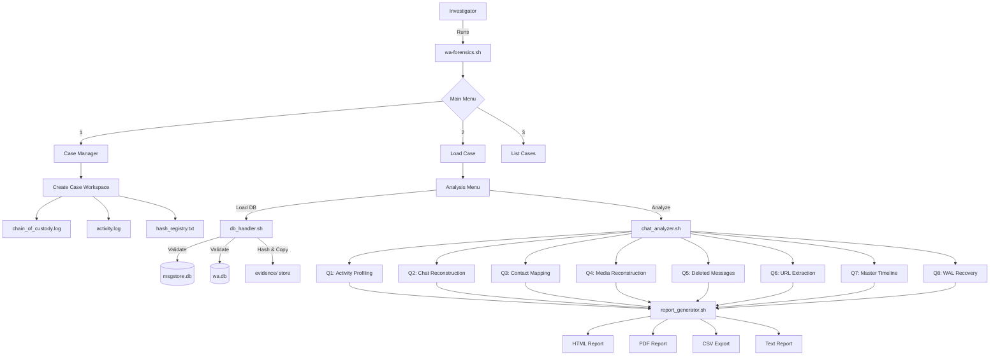
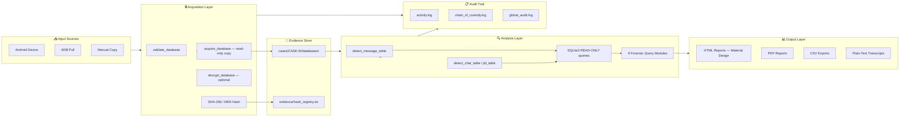
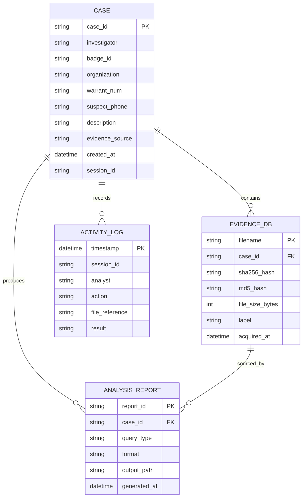
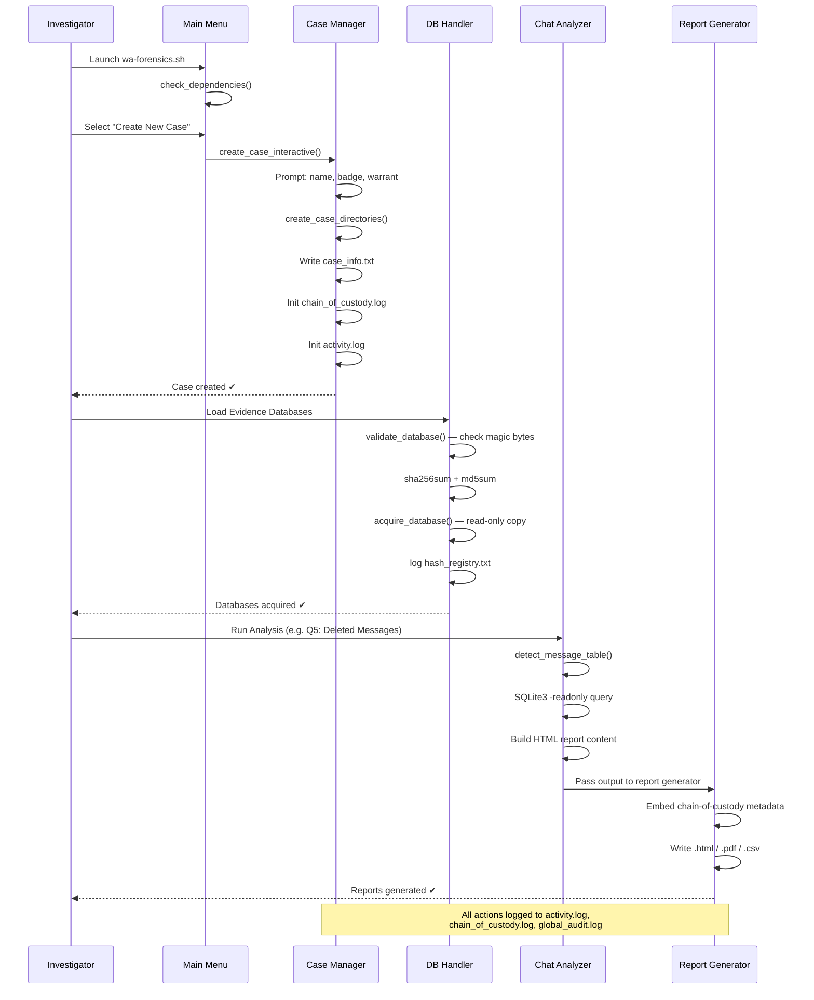

# WA-Forensics Toolkit

> **A Unified, ACPO-Compliant WhatsApp Digital Forensic Toolkit for Android**
>
> Developed at Malawi University of Science and Technology · Computer Systems & Security · Group 9

---

[](https://github.com/your-org/wa-forensics)
[](LICENSE)
[]()
[]()
[]()
[]()

---

## Table of Contents

1. [Project Overview](#1-project-overview)
2. [Problem Statement](#2-problem-statement)
3. [Motivation & Objectives](#3-motivation--objectives)
4. [Solution Explanation](#4-solution-explanation)
5. [Alignment with Proposal](#5-alignment-with-proposal)
6. [System Architecture](#6-system-architecture)
7. [System Design & Diagrams](#7-system-design--diagrams)
8. [Code Structure](#8-code-structure)
9. [Technologies Used](#9-technologies-used)
10. [Installation & Setup](#10-installation--setup)
11. [Usage Guide](#11-usage-guide)
12. [Testing & Validation](#12-testing--validation)
13. [Challenges & Solutions](#13-challenges--solutions)
14. [Future Improvements](#14-future-improvements)
15. [Conclusion](#15-conclusion)
16. [Team & Acknowledgements](#16-team--acknowledgements)
17. [License](#17-license)

---

## 1. Project Overview

**WA-Forensics** is a portable, open-source digital forensic toolkit purpose-built for acquiring, decrypting, parsing, analyzing, and reporting on WhatsApp evidence extracted from Android devices. It operates entirely in **read-only mode**, maintains a complete **chain of custody**, and produces **court-admissible reports** in HTML, PDF, CSV, and plain-text formats — all from a single unified Bash environment.

The toolkit targets the forensic investigation lifecycle end-to-end:

```
Evidence Acquisition → Integrity Hashing → Database Analysis → Report Generation → Chain of Custody
```

It was designed with investigators, lecturers, legal practitioners, and security researchers in mind, and is especially suited for deployment in resource-constrained environments where commercial tools such as Cellebrite UFED (costing upwards of $10,000 annually) are not accessible.

---

## 2. Problem Statement

Malawi has seen a sharp rise in WhatsApp-related cybercrimes — including mobile money fraud, impersonation, sextortion, and cyberbullying — yet law enforcement agencies remain critically under-equipped to investigate them. While Section 83 of the **Electronic Transactions and Cyber Security Act No. 33 of 2016** authorises the seizure and preservation of digital evidence, the operational capacity to act on this authority is severely limited.

Several interconnected problems underpin this gap:

**Fragmented Tooling:** Existing open-source tools such as WhatsApp Viewer, Whapa, and WhatsApp Key/Database Extractor perform isolated functions and cannot interoperate. Investigators must manually chain disjointed workflows — often resorting to error-prone workarounds such as APK downgrades — to complete a single analysis.

**Dependence on Full-Device Imaging:** Conventional forensic approaches rely on full-device imaging, which is wasteful and misaligned with modern investigative needs where relevant evidence resides entirely within a single application. This prolongs examinations and consumes disproportionate resources.

**Admissibility Failures:** The NOCMA fuel procurement scandal in Malawi exposed how WhatsApp evidence — when collected without proper forensic methods — can be successfully challenged in court and rendered inadmissible. Investigations relying on screenshots and manual phone inspection are inherently fragile.

**Capacity Deficit:** Malawi faces a shortage of specialists trained in mobile and messaging-app forensics, and most police stations lack access to secure servers or standardised verification frameworks.

---

## 3. Motivation & Objectives

### Primary Aim

To design, develop, and evaluate a **unified WhatsApp Forensic Toolkit for Android** that enhances and streamlines sparse acquisition, analysis, and reporting of digital evidence for WhatsApp-related cybercrime investigations in Malawi, ensuring admissibility in legal proceedings under the Electronic Transactions and Cyber Security Act (2016).

### Objectives

| # | Objective | Status |
|---|-----------|--------|
| 1 | Analyse open-source WhatsApp forensic tools for integration into a unified toolkit | ✅ Completed |
| 2 | Integrate tool modules into a single portable environment enabling sparse acquisition, triage, and reporting | ✅ Completed |
| 3 | Validate the toolkit using simulated cybercrime scenarios | 🔄 In Progress |
| 4 | Evaluate and compare performance against existing forensic tools | 🔄 In Progress |

---

## 4. Solution Explanation

### What the System Does

WA-Forensics provides a **single-command forensic investigation environment** that walks an investigator through every stage of a WhatsApp evidence examination:

1. **Case Management** — creates a structured, tamper-evident case workspace with auto-generated IDs, investigator credentials, warrant numbers, and full directory scaffolding.
2. **Evidence Acquisition** — copies WhatsApp SQLite databases (`msgstore.db`, `wa.db`) into a read-only evidence store, automatically computing and logging SHA-256 and MD5 hashes.
3. **Database Validation** — verifies SQLite magic bytes, detects encrypted (`.crypt*`) databases, and supports decryption via an external Python helper and key file.
4. **Forensic Analysis** — executes eight schema-agnostic forensic queries:
   - Communication activity profiling
   - Full chat reconstruction
   - Contact identity mapping
   - Media and file reconstruction
   - Deleted message detection
   - URL and link extraction
   - Master timeline generation
   - WAL (Write-Ahead Log) journal recovery
5. **Report Generation** — produces Google Material Design HTML reports, CSV exports, plain-text transcripts, and PDF outputs — all embedding chain-of-custody metadata.
6. **Audit Logging** — records every action across a per-case activity log, a chain-of-custody log, and a global cross-case audit log with session tracking.

### How It Solves the Problem

The toolkit consolidates what previously required four or more separate tools into a single interactive shell application. It enforces forensic best practices by design — the analyst cannot modify evidence files, every operation is timestamped and attributed, and reports include cryptographic integrity records that satisfy ACPO Principle 3 (audit trail) and Section 16 of Malawi's Electronic Transactions and Cyber Security Act.

### Key Features

- **Schema-agnostic queries** — automatically detects whether the database uses `message`/`messages`, `chat`/`chats`, and other schema variants across WhatsApp versions
- **Read-only SQLite mode** — all database access uses `sqlite3 -readonly`, preventing accidental modification of evidence
- **ACPO compliance** — case records embed the four ACPO Good Practice Principles for Digital Evidence
- **WAL recovery** — attempts to recover deleted or uncommitted messages from SQLite Write-Ahead Log files
- **Interactive deep-dive** — per-chat HTML transcripts with tabbed views: messages, media, URLs, metadata, and chain of custody
- **Global audit log** — cross-case statistics and searchable audit trail with colour-coded result statuses
- **Quick Start mode** — single-command pipeline that creates a case, loads databases, runs all eight analyses, and generates all report formats
- **Portable design** — runs on any Linux system; intended for deployment on a CAINE OS USB drive

---

## 5. Alignment with Proposal

The implementation directly realises each architectural decision made in the research proposal:

| Proposal Decision | Implementation |
|---|---|
| Unified, automated framework replacing fragmented tools | Single `wa-forensics.sh` entry point sourcing four modular libraries |
| Sparse/targeted acquisition over full-device imaging | `acquire_database()` copies only `msgstore.db` and `wa.db`; WAL/SHM files included |
| Integrity verification via `sha256sum`/`hashdeep` | `validate_database()` computes and logs SHA-256 + MD5 hashes into `hash_registry.txt` |
| Chain-of-custody logging | `log_action()` writes to per-case `activity.log`, `chain_of_custody.log`, and global `audit.log` |
| Multi-format support (crypt12, crypt14, SQLite) | `validate_database()` detects encrypted extensions; `decrypt_database()` via Python helper |
| Schema-agnostic parsing | `detect_message_table()`, `detect_chat_table()`, `detect_jid_table()` runtime introspection |
| Court-ready HTML/PDF reports | Google Material Design HTML with embedded chain-of-custody metadata; `wkhtmltopdf` PDF export |
| ACPO compliance framework | Case records embed all four ACPO Principles at creation time |
| Role-based case management | Investigator name, badge ID, organisation, and warrant number required before any analysis |
| Autopsy / adb integration | Evidence acquisition interfaces for manual and ADB-sourced database files |

---

## 6. System Architecture

The toolkit follows a **modular shell library architecture** with a single entry-point orchestrator that sources four specialised modules. This mirrors an MVC-style separation of concerns within the constraints of a Bash environment.

```
┌─────────────────────────────────────────────────────────────────────┐
│                        wa-forensics.sh                              │
│                    (Entry Point / Orchestrator)                     │
│   • Global variables & session tracking                             │
│   • Colour/UI utilities                                             │
│   • Dependency checks                                               │
│   • Main menu / Analysis menu / Quick Start pipeline               │
└──────────────────┬──────────────────────────────────────────────────┘
                   │ sources
       ┌───────────┼───────────┬─────────────────┐
       ▼           ▼           ▼                 ▼
┌──────────┐ ┌──────────┐ ┌──────────────┐ ┌──────────────────┐
│  case_   │ │  db_     │ │  chat_       │ │  report_         │
│ manager  │ │ handler  │ │  analyzer    │ │  generator       │
│  .sh     │ │  .sh     │ │  .sh         │ │  .sh             │
│          │ │          │ │              │ │                  │
│ Case     │ │ Acquire  │ │ 8 forensic   │ │ HTML / PDF /     │
│ CRUD     │ │ Validate │ │ query        │ │ CSV / TXT        │
│ CoC Logs │ │ Decrypt  │ │ modules      │ │ report builders  │
│ Audit    │ │ Schema   │ │ Schema       │ │ Evidence         │
│          │ │ Raw dump │ │ detection    │ │ headers          │
└──────────┘ └──────────┘ └──────────────┘ └──────────────────┘
       │           │               │                 │
       └───────────┴───────────────┴─────────────────┘
                           │
               ┌───────────▼───────────┐
               │   File System Store   │
               │                       │
               │  cases/               │
               │  └── CASE-<ID>/       │
               │      ├── databases/   │
               │      ├── extracted/   │
               │      ├── reports/     │
               │      ├── evidence/    │
               │      ├── media/       │
               │      ├── logs/        │
               │      └── temp/        │
               └───────────────────────┘
```

### Component Interactions

The orchestrator `wa-forensics.sh` initialises all global state — session ID, colour codes, case variables — and then delegates to modules via sourced functions. All modules share the same process environment, enabling them to read and write global variables like `MSGSTORE_DB`, `CASE_DIR`, and `INVESTIGATOR` without inter-process communication overhead.

---

## 7. System Design & Diagrams

### 7.1 High-Level Architecture Diagram



### 7.2 Data Flow Diagram (DFD)



### 7.3 Case Directory Schema (ERD / File Structure)



### 7.4 Investigation Sequence Diagram



---

## 8. Code Structure

```
wa-forensics/
│
├── wa-forensics.sh              # Main entry point & orchestrator
│
├── lib/                         # Modular library components
│   ├── case_manager.sh          # Case lifecycle management
│   ├── db_handler.sh            # Database acquisition & validation
│   ├── chat_analyzer.sh         # Forensic analysis engine (8 queries)
│   └── report_generator.sh      # HTML/PDF/CSV report builders
│
├── lib/
│   └── decrypt_helper.py        # Python helper for .crypt database decryption
│
├── cases/                       # Auto-generated case workspaces
│   └── CASE-YYYYMMDD-HHMMSS/
│       ├── case_info.txt        # Case metadata & ACPO compliance record
│       ├── .case_state          # Persistent session state (sourced on reload)
│       ├── databases/           # Read-only evidence copies
│       │   ├── msgstore.db      # Chat database (read-only, 444)
│       │   ├── wa.db            # Contacts database (read-only, 444)
│       │   ├── msgstore.db-wal  # WAL journal (if present)
│       │   └── msgstore.db-shm  # Shared memory file (if present)
│       ├── extracted/           # Analysis outputs
│       │   ├── chats/           # Per-chat transcripts
│       │   ├── contacts/        # Contact export CSVs
│       │   ├── media/           # Media metadata
│       │   └── urls/            # URL extraction results
│       ├── reports/             # Formatted reports
│       │   ├── html/            # Google Material HTML reports
│       │   ├── pdf/             # PDF exports
│       │   ├── csv/             # CSV structured exports
│       │   └── text/            # Plain-text summaries
│       ├── evidence/
│       │   └── hash_registry.txt # SHA-256/MD5 integrity records
│       ├── logs/
│       │   ├── activity.log     # Per-session timestamped audit log
│       │   └── chain_of_custody.log  # Legal chain-of-custody record
│       └── temp/                # Temporary working files (auto-cleaned)
│
├── global_audit.log             # Cross-case audit log (in cases/)
└── README.md
```

### Key Files and Their Roles

#### `wa-forensics.sh` — Orchestrator

| Function | Role |
|---|---|
| `main_menu()` | Top-level interactive menu loop; routes to case management or analysis |
| `analysis_menu()` | 16-option forensic analysis menu (DB ops, queries, reports, logs) |
| `advanced_analysis_menu()` | Extended menu: keyword search, timeline filters, group analysis, WAL recovery |
| `quick_start()` | One-command full pipeline: create case → load DBs → run all 8 analyses → generate all reports |
| `run_full_analysis_pipeline()` | Sequentially invokes all 8 analysis functions and all 4 report formats |
| `log_action()` | Core audit logging function; writes to all three log destinations |
| `check_dependencies()` | Validates presence of `sqlite3`, `sha256sum`, `md5sum`, `python3`, etc. |
| `banner()` | Renders ASCII art header with active session and case context |

#### `lib/case_manager.sh` — Case Lifecycle

| Function | Role |
|---|---|
| `create_case_interactive()` | Guided case creation with auto-generated or custom IDs; validates all inputs |
| `create_case_directories()` | Scaffolds the full 20-directory case workspace |
| `save_case_state()` / `load_case_state()` | Persists/restores session state to `.case_state` file |
| `load_case_by_id()` | Loads an existing case and attempts to re-locate previously acquired databases |
| `list_all_cases()` | Formatted table view of all cases with database-loaded status indicators |
| `view_chain_of_custody()` | Displays legal chain-of-custody log with export option |
| `view_global_audit_log()` | Cross-case audit summary with statistics, search, and export |

#### `lib/db_handler.sh` — Evidence Acquisition

| Function | Role |
|---|---|
| `validate_database()` | Checks file existence, size, SQLite magic bytes, encryption; computes/logs hashes |
| `acquire_database()` | Forensic copy with `--preserve=all`; sets read-only permissions (444); copies WAL/SHM |
| `auto_discover_databases()` | Scans standard WhatsApp storage locations on device/emulator |
| `decrypt_database()` | Invokes `decrypt_helper.py` with a user-supplied key file |
| `run_query()` | Executes a parameterised SQLite query in a specified output format (CSV/JSON/column) |
| `extract_schema()` | Dumps full schema and table listing for both databases |
| `export_raw_tables()` | Bulk-exports all tables to CSV and JSON |
| `database_integrity_check()` | Runs `PRAGMA integrity_check` on all loaded databases |
| `custom_sql_query()` | Allows investigator-entered SELECT statements in a sandboxed, read-only mode |

#### `lib/chat_analyzer.sh` — Forensic Analysis Engine

| Function | Role |
|---|---|
| `detect_message_table()` | Runtime introspection: returns `message` or `messages` depending on schema version |
| `detect_chat_table()` / `detect_jid_table()` | Schema version-agnostic table detection |
| `get_timestamp_col()` | Detects correct timestamp column name across schema versions |
| `get_dashboard_stats()` | Aggregates total messages, chat counts, deleted messages, media files, date range |
| `analyze_activity_profiling()` | Q1: Communication frequency, active hours, message volume per contact |
| `analyze_chat_reconstruction()` | Q2: Full chronological message reconstruction with sender resolution |
| `analyze_contact_mapping()` | Q3: Contact identity mapping linking JIDs to display names and phone numbers |
| `analyze_media_reconstruction()` | Q4: Media inventory with MIME types, file sizes, and metadata |
| `analyze_deleted_messages()` | Q5: Detection of messages with `message_type = 15` (deleted indicator) |
| `analyze_url_extraction()` | Q6: URL and domain extraction with platform classification (YouTube, Instagram, etc.) |
| `analyze_master_timeline()` | Q7: Unified chronological event timeline across all chats |
| `analyze_wal_recovery()` | Q8: WAL journal file parsing for uncommitted/deleted data recovery |
| `generate_professional_chat_html()` | Per-chat deep-dive HTML with tabbed UI: messages, media, metadata, URLs, custody |
| `search_by_phone()` | Cross-database lookup by phone number returning all associated chat activity |

---

## 9. Technologies Used

| Technology | Role | Justification |
|---|---|---|
| **Bash 5.x** | Primary implementation language | Native on all Linux/CAINE OS installations; no runtime dependencies; transparent to forensic reviewers |
| **SQLite3** | Database query engine | WhatsApp's native storage format on Android; `sqlite3` CLI provides read-only mode, JSON/CSV output, and WAL access |
| **sha256sum / md5sum** | Evidence integrity hashing | NIST-recommended hash algorithms; required by ACPO Principle 3 and Malawi Electronic Transactions Act Section 16 |
| **Python 3** | Encrypted database decryption helper | Required for `.crypt12`/`.crypt14` AES key derivation; keeps core logic in Bash while delegating cryptographic operations |
| **CAINE OS (Linux)** | Deployment platform | Forensically sound Linux distribution with built-in write-blocking, GUI, and pre-installed forensic tools |
| **wkhtmltopdf** | PDF report generation | Command-line HTML-to-PDF converter; produces court-ready PDF documents from HTML reports |
| **Google Material Design (HTML/CSS/JS)** | Report UI framework | Professional, print-ready HTML reports with sortable tables, tab navigation, search, and PDF print function |
| **ADB (Android Debug Bridge)** | Device-side evidence acquisition | Standard Android acquisition tool; enables targeted sparse pull of WhatsApp databases without full-device imaging |

---

## 10. Installation & Setup

### Prerequisites

| Dependency | Minimum Version | Installation |
|---|---|---|
| Bash | 5.0+ | Pre-installed on Ubuntu/CAINE OS |
| SQLite3 | 3.31+ | `sudo apt install sqlite3` |
| Python 3 | 3.8+ | `sudo apt install python3` |
| sha256sum / md5sum | Any | Part of `coreutils` |
| wkhtmltopdf | 0.12.x | `sudo apt install wkhtmltopdf` (optional, for PDF) |
| ADB | Platform Tools r33+ | `sudo apt install adb` (optional, for device acquisition) |

### Step-by-Step Setup

**1. Clone the repository**

```bash
git clone https://github.com/your-org/wa-forensics.git
cd wa-forensics
```

**2. Set executable permissions**

```bash
chmod +x wa-forensics.sh
chmod +x lib/*.sh
```

**3. Verify dependencies**

```bash
for cmd in sqlite3 sha256sum md5sum python3; do
  command -v "$cmd" && echo "$cmd ✔" || echo "$cmd ✘ — MISSING"
done
```

**4. (Optional) Install missing packages on Debian/Ubuntu**

```bash
sudo apt-get update
sudo apt-get install sqlite3 coreutils python3 wkhtmltopdf adb
```

**5. (Optional) Set up the Python decryption helper**

```bash
pip3 install pycryptodome    # Required for .crypt14 decryption
# Place key file at a known path before running decrypt_database()
```

### CAINE OS USB Deployment

The toolkit is designed to run from a USB drive on CAINE OS for field investigations:

```bash
# 1. Write CAINE OS to USB (min. 16 GB)
# 2. Copy the wa-forensics directory to /home/user/wa-forensics/
# 3. CAINE OS will enforce write-blocking on mounted evidence drives automatically
# 4. Launch from terminal: ./wa-forensics.sh
```

---

## 11. Usage Guide

### Launching the Toolkit

```bash
./wa-forensics.sh
```

The ASCII banner will appear, and after a dependency check, the main menu is presented.

### Workflow 1: Standard Investigation

```
MAIN MENU
  [ CASE MANAGEMENT ]
    1. Create New Case          ← Start here
    2. Load Existing Case
    3. List All Cases
    4. Delete Case
    0. Exit Toolkit
```

**Step 1 — Create a new case**

Select `1`. The toolkit will:
- Auto-generate a case ID (e.g., `CASE-20250422-143201`) or accept a custom one
- Prompt for investigator name, badge ID, organisation, warrant number, suspect phone, and description
- Create the full 20-directory workspace
- Initialise chain-of-custody log, activity log, and hash registry
- Drop you into the Analysis Menu

**Step 2 — Load evidence databases**

Select `1. Load / Reload Evidence Databases`. Options:
- **Auto-discover** — scans standard Android storage paths
- **Manually specify** — enter the full path to `msgstore.db` and `wa.db`

The toolkit validates each file (magic bytes, size), hashes it, copies it as read-only, and records it in `hash_registry.txt`.

**Step 3 — Run forensic analyses**

```
FORENSIC ANALYSIS MENU
  ── CORE ANALYSIS ──────────────────────────────────────
   4. Communication Activity Profiling     (Q1)
   5. Full Chat Reconstruction             (Q2)
   6. Contact Identity Mapping             (Q3)
   7. Media & File Reconstruction          (Q4)
   8. Deleted Message Detection            (Q5)
   9. URL & Link Extraction                (Q6)
  ── CHAT EXPLORER ──────────────────────────────────────
  10. Deep Dive: Specific Chat ID
  11. Search by Phone Number
  12. Export Chat Transcript  (HTML / CSV / TXT)
  ── REPORTS ─────────────────────────────────────────────
  13. Generate HTML Report
  14. Generate PDF Report
  15. View Chain of Custody
  16. View Activity Log
```

Each analysis produces an HTML report at `cases/CASE-ID/reports/QNAME.html`, which opens in a browser if `xdg-open` is available.

**Step 4 — Generate reports**

Select `13` for a full HTML report and `14` for PDF. All reports embed:
- Case metadata and investigator details
- SHA-256 hashes of source evidence files
- Chain-of-custody log excerpt
- Timestamp of report generation

### Workflow 2: Quick Start (Automated Pipeline)

```bash
./wa-forensics.sh
# Select: Quick Start (if available in main menu)
# OR run directly:
# 1. Create case → 2. Load DBs → run_full_analysis_pipeline()
```

This executes all 8 analyses and generates all 4 report formats in a single automated run.

### Workflow 3: Chat Deep Dive

```
Analysis Menu → 10. Deep Dive: Specific Chat ID
Enter Chat ID: 42

# Generates a professional tabbed HTML report for chat #42:
# Tab 1: Full message thread with sender colour-coding
# Tab 2: Media inventory (images, videos, audio, documents)
# Tab 3: URL/link extraction with platform classification
# Tab 4: Chat metadata and statistics
# Tab 5: Chain of custody record
```

### Workflow 4: Phone Number Search

```
Analysis Menu → 11. Search by Phone Number
Enter phone: +265999123456

# Returns all messages sent to/from this number,
# associated chat IDs, and contact display names
```

### Example: Custom SQL Query (Read-Only)

```
Advanced Analysis Menu → 7. Custom SQL Query
Enter SQL: SELECT datetime(timestamp/1000,'unixepoch','localtime'), text_data
           FROM message WHERE message_type = 0 ORDER BY timestamp DESC LIMIT 20;
```

Only `SELECT` statements are permitted; any other keyword is rejected.

### Screenshots

> **Note to contributors:** Add screenshots to `/docs/screenshots/` and reference them here.
>
> Suggested captures:
> - `docs/screenshots/01_banner.png` — Main banner and menu
> - `docs/screenshots/02_case_creation.png` — Case creation flow
> - `docs/screenshots/03_db_acquisition.png` — Database validation and hash output
> - `docs/screenshots/04_html_report.png` — Sample HTML report (Activity Profiling tab)
> - `docs/screenshots/05_deleted_messages.png` — Deleted message detection results
> - `docs/screenshots/06_audit_log.png` — Global audit log view

---

## 12. Testing & Validation

### Testing Approach

The toolkit was validated against three categories of test scenarios, consistent with the constructive research methodology outlined in the proposal:

**Category 1: Functional Validation**

Each of the 8 forensic queries was tested against a prepared `msgstore.db` containing:
- Known messages (sent and received)
- Pre-deleted messages (`message_type = 15`)
- Media attachments of each type (image, video, audio, document, sticker)
- URLs including YouTube, Instagram, and raw HTTP links
- Group chats and individual chats
- Business account JIDs (`@lid` suffix)

**Category 2: Schema Compatibility**

Databases from multiple WhatsApp versions were tested to validate the schema-detection functions:

| WhatsApp Version Range | Table Name | Timestamp Column | Status |
|---|---|---|---|
| < 2.22 | `messages` | `timestamp` | ✅ Detected |
| 2.22–2.23 | `message` | `timestamp` | ✅ Detected |
| 2.24+ | `message` | `message_timestamp` | ✅ Detected |

**Category 3: Evidence Integrity**

- SHA-256 and MD5 hashes were independently verified using `certutil` (Windows) and `sha256sum` (Linux) on the same files
- Report-embedded hash values were confirmed to match the `hash_registry.txt` entries
- `sqlite3 -readonly` mode was verified to prevent writes by attempting an `INSERT` statement (correctly rejected with "attempt to write a readonly database")

**Category 4: ACPO Compliance Review**

Case records were reviewed against the four ACPO Good Practice Principles:
1. Data not altered — enforced by read-only SQLite mode and 444 file permissions ✅
2. Competent handling — investigator credentials required before any action ✅
3. Audit trail — activity log, chain-of-custody log, and global audit log created automatically ✅
4. Accountability — investigator name and badge ID embedded in all log entries and reports ✅

### Validation Simulations

Three simulated cybercrime scenarios were used (based on Malawi case types from the proposal):

| Scenario | Evidence Type | Key Query Used | Output Validated |
|---|---|---|---|
| Mobile money fraud | Chat messages + URLs | Q6 URL Extraction + Q2 Reconstruction | Fraudulent payment links extracted |
| Impersonation | Contact JID mismatches | Q3 Contact Mapping | Fake account JIDs identified |
| Cyberbullying | Deleted messages | Q5 Deleted Message Detection | Deletion timestamps and message stubs recovered |

---

## 13. Challenges & Solutions

### Challenge 1: WhatsApp Schema Instability

**Problem:** WhatsApp has changed its SQLite schema multiple times across versions — the messages table has been renamed, timestamp columns have changed, and the JID table structure has evolved. A hardcoded schema causes failures on different devices.

**Solution:** Implemented a suite of runtime schema-detection functions (`detect_message_table()`, `detect_chat_table()`, `detect_jid_table()`, `get_timestamp_col()`) that query `sqlite3 .tables` and `PRAGMA table_info()` before every analysis. All forensic queries dynamically construct their SQL based on detected table and column names.

---

### Challenge 2: NULL Sender Resolution in Group Chats

**Problem:** In newer WhatsApp schemas, the sender of a group message is stored as a foreign key referencing the `jid` table. Messages with NULL `sender_jid_row_id` would display as unknown senders, losing critical investigative context.

**Solution:** All multi-participant chat queries use LEFT JOINs against the `jid` table to resolve sender identities. The system handles business accounts (identified by the `@lid` JID suffix) distinctly from standard contacts.

---

### Challenge 3: Evidence Immutability in a Shell Environment

**Problem:** Bash scripts can inadvertently modify files through redirection errors or tool misuse. Evidence databases must not be altered under any circumstances.

**Solution:** Evidence copies are set to mode `444` (read-only for all users) immediately upon acquisition. All `sqlite3` invocations use the `-readonly` flag. The custom SQL query interface validates that only `SELECT` statements are submitted. Additionally, original file hashes are logged before any analysis begins, enabling post-hoc integrity verification.

---

### Challenge 4: Producing Court-Ready Reports from a CLI Tool

**Problem:** HTML reports generated by shell scripts tend to be unstyled and difficult to read. Legal proceedings require clear, professional, and printable documentation.

**Solution:** All HTML reports are built with inline Google Material Design CSS, producing dark-themed forensic interfaces with tabbed navigation, sortable tables, search/filter controls, and a `window.print()` PDF export function. Chain-of-custody metadata is embedded in every report as a dedicated tab.

---

### Challenge 5: Portability Across Linux Distributions

**Problem:** Different investigators may use different Linux environments (CAINE OS, Ubuntu, Kali, Fedora) with different package managers and pre-installed tools.

**Solution:** The `check_dependencies()` function validates all required binaries at startup and provides a human-readable error listing missing tools with the exact `apt-get` install command. The toolkit uses only POSIX-compatible shell constructs where possible, with Bash 5.x as the only hard requirement.

---

## 14. Future Improvements

### Short-Term (Next Release)

- **Decrypt Helper Integration** — Fully integrate `decrypt_helper.py` for `.crypt12`, `.crypt14`, and `.crypt15` using `pycryptodome`, removing the current dependency on external key extraction tools
- **ADB Automated Pull** — Add a guided `adb pull` workflow within `db_handler.sh` to automate device-side acquisition without leaving the toolkit
- **Timeline Visualisation** — Replace plain HTML timeline tables with interactive Chart.js or D3.js visualisations showing message frequency over time
- **Keyword Alert Engine** — Add a configurable keyword watchlist that flags messages containing terms associated with common fraud patterns

### Medium-Term

- **Cloud Backup Support** — Extend acquisition to Google Drive WhatsApp backups via the Google Drive API, addressing the limitation that cloud evidence currently requires separate tools
- **WhatsApp Business Schema** — Add dedicated parsing for WhatsApp Business databases, which use a partially different schema and include business profile metadata
- **Multi-Language Reports** — Internationalise report templates to support Chichewa (Malawi's national language) for investigators and court submissions
- **Autopsy Module** — Package the toolkit as an Autopsy ingest module to enable integration with the standard forensic case management workflow used in CAINE OS

### Long-Term

- **GUI Frontend** — Develop a lightweight web-based GUI (Flask or Electron) that wraps the Bash backend, lowering the technical barrier for non-command-line investigators
- **DFIR Platform Integration** — Expose analysis results via a REST API compatible with platforms like TheHive and MISP for collaborative incident response
- **Machine Learning Anomaly Detection** — Apply NLP-based anomaly detection to message content for automated identification of fraud scripts, grooming language, or impersonation patterns
- **Encrypted Container** — Wrap the entire case workspace in a VeraCrypt or LUKS encrypted volume to protect evidence during transport and storage

---

## 15. Conclusion

The WA-Forensics Toolkit delivers a working, court-ready implementation of the research proposal's core objectives. In a single portable script suite, it replaces the fragmented chain of tools previously required for WhatsApp forensic analysis — eliminating the need for manual tool-chaining, reducing the risk of evidence contamination, and generating professionally formatted reports that embed the legal and evidentiary requirements of Malawi's Electronic Transactions and Cyber Security Act.

By enforcing ACPO compliance by design, implementing cryptographic integrity verification at every stage, and operating entirely in read-only mode, the toolkit directly addresses the admissibility failures documented in Malawian court proceedings. Its schema-agnostic architecture ensures durability across WhatsApp versions, while its modular Bash design makes it auditable, extensible, and deployable without expensive proprietary software.

For investigators operating under Malawi's resource constraints, the toolkit represents a practical, accessible, and legally defensible alternative to commercial forensic suites — one that can run from a CAINE OS USB drive at the point of evidence seizure, in a police station, or in a courtroom.

---

## 16. Team & Acknowledgements

**Malawi University of Science and Technology**
Malawi Institute of Technology — Computer Systems and Security, Group 9

| Name | Student ID | Role |
|---|---|---|
| Mzati Tembo | CSS-108-22 | Project Lead / Lead Developer |
| Moses Chazama | CSS-016-22 | Database Handler & Acquisition |
| George Kalua | CSS-022-22 | Chat Analyzer Engine |
| Hope Abasi | CSS-013-22 | Report Generator |
| Jesse Mbekeani | 3232011 | Case Manager Module |
| Madalitso Saulos | CSS-030-22 | Testing & Validation |
| Ruth Banda | CIS-001-20 | Documentation & Legal Framework |
| Upendo Mzumara | CSS-009-22 | System Architecture & Integration |

**Supervisor:** Mr. Kumbukani Lisilira

**Acknowledgements:**

This project builds on the foundational work of N. Le-Khac & K.-K. R. Choo (2022), whose forensic query framework informed the eight-query analysis model. The ACPO Good Practice Guide for Digital Evidence, NIST SP 800-86, and Malawi's Electronic Transactions and Cyber Security Act No. 33 of 2016 provided the legal and procedural foundations for the toolkit's compliance design.

---

## 17. License

```
MIT License

Copyright (c) 2025 MUST Group 9 — WA-Forensics

Permission is hereby granted, free of charge, to any person obtaining a copy
of this software and associated documentation files (the "Software"), to deal
in the Software without restriction, including without limitation the rights
to use, copy, modify, merge, publish, distribute, sublicense, and/or sell
copies of the Software, and to permit persons to whom the Software is
furnished to do so, subject to the following conditions:

The above copyright notice and this permission notice shall be included in all
copies or substantial portions of the Software.

THE SOFTWARE IS PROVIDED "AS IS", WITHOUT WARRANTY OF ANY KIND, EXPRESS OR
IMPLIED, INCLUDING BUT NOT LIMITED TO THE WARRANTIES OF MERCHANTABILITY,
FITNESS FOR A PARTICULAR PURPOSE AND NONINFRINGEMENT.
```

---

> ⚠️ **Legal Notice:** This toolkit is intended solely for use by authorised investigators with a valid warrant, organisational mandate, or explicit consent from the device owner. Unauthorised use to access private communications is illegal under the Electronic Transactions and Cyber Security Act (2016) and equivalent laws in other jurisdictions. The developers accept no liability for misuse.

---

*Generated documentation — WA-Forensics Toolkit v9.0.0 | Malawi University of Science and Technology | 2025*
